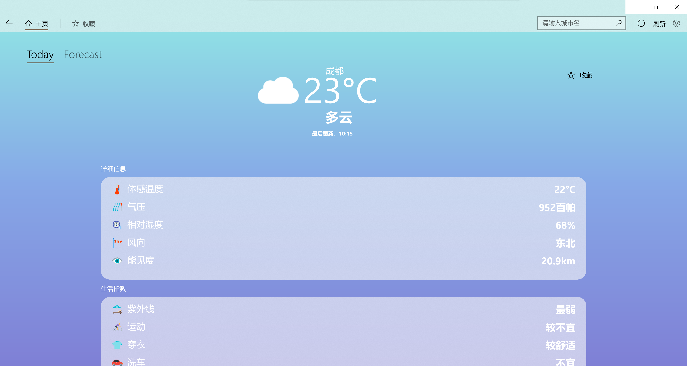
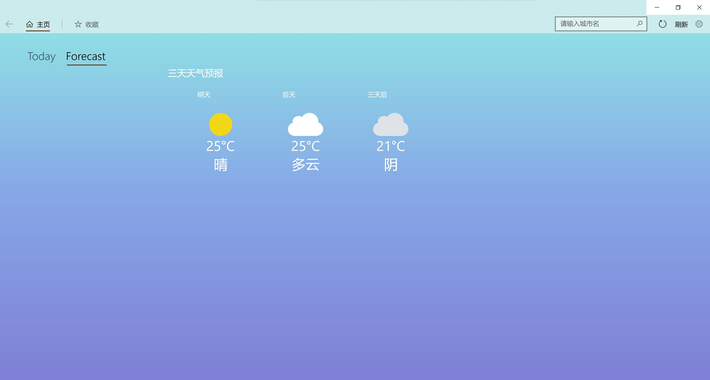
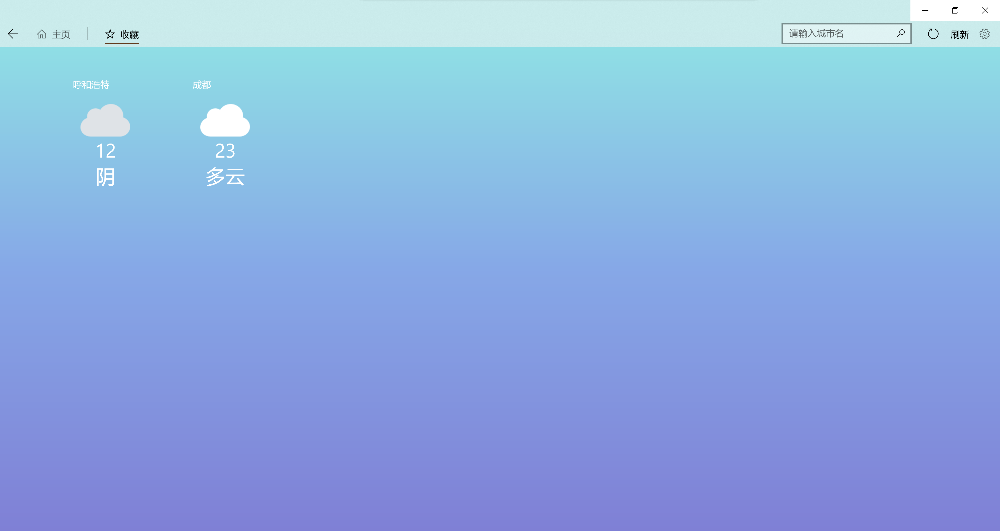
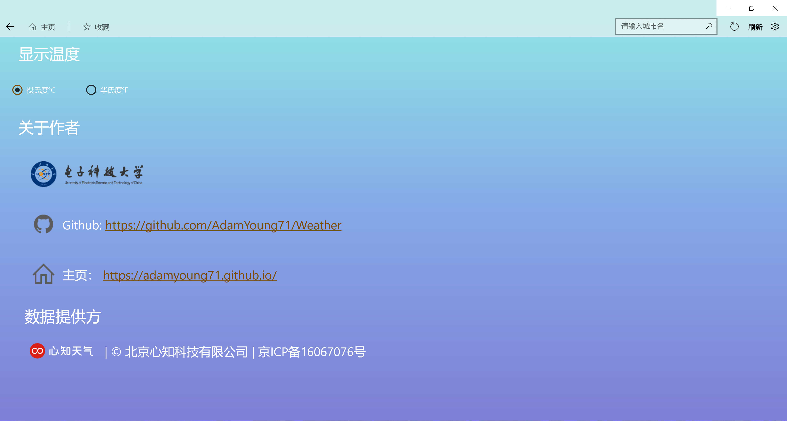

# Weather

大二下学期综合课程设计课题

## 基于SOA的天气预报软件
### 主要功能：
1. 提供实时天气服务。
2. 提供天气详细信息服务（体感温度、气压、相对湿度、风向、能见度）
3. 提供生活指数服务（紫外线、运动、穿衣、洗车、感冒指数）
4. 提供空气质量服务（整体空气质量、AQI、PM2.5，臭氧和首要污染物）
5. 提供三天天气预报功能。
6. 提供城市收藏功能：点击收藏后可以将城市和对应天气存入收藏页面，在收藏页面再次点击可随时查询该城市天气。
7. 提供基于城市名称的搜索功能，并针对用户输入产生联想。

## 界面
1. 主页

   

2. 三天天气预报

   

3. 收藏

   

4. 设置

   